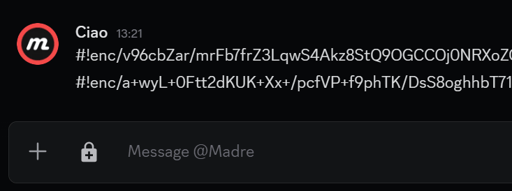

# Discord Encryption

[](https://github.com/hmerritt/discord-encryption/actions/workflows/build.yml)

> We're back baby :)

An experimental encryption solution for Discord using [BetterDiscord](https://github.com/rauenzi/BetterDiscordApp/releases).

Download the `encryption.plugin.js` from the releases [here](https://github.com/hmerritt/discord-encryption/releases/latest).

## Features ⚡

Adds ability to encrypt / decrypt messages on discord using a set password

- Utilizes `AES-GCM` (Advanced Encryption Standard in Galois/Counter Mode) via native [Web Crypto API](https://developer.mozilla.org/en-US/docs/Web/API/Web_Crypto_API)
- Passwords are saved per-chat
- Messages are decrypted the moment they are receved with little to no delay
- Encrypted messages appear as green
- Messages that fail to be decrypted (most likely due to an incorrect password) will be highlighted red



## How to use

### Install

- Install Discord
- Install BetterDiscord
- Navigate to Discord Preferences -> BD/Plugins -> Open Plugin Folder
- Place 'encryption.plugin.js' in BetterDiscord's plugin folder
- Enable encryption in the BD/Plugins preference pane.

> It may ask to install an additional plugin `0PluginLibrary.plugin` which is required - It should install itself if you click `download`.

### Usage

- To toggle the encryption simply click the lock icon. You will be prompted for a password, if none is found for the chat channel.
- Received messages are decrypted automatically
- To view or change the encryption password simply right-click the lock icon and an input box will appear - passwords are automatically saved as you type


### Encrypted Message


### Encrypted Message that failed to decrypt


### Decrypted Message


## Development

This plugin uses [`rollup`](https://rollupjs.org/) to bundle what's in `src` into the final `encryption.plugin.js` script.

Getting `rollup` to work with `BetterDiscord` was a **gamechanger** as it allows the plugin to use multiple src files instead of just one. This makes development much nicer.

How to build Build:

```
$ yarn && yarn build
```

> This runs both `rollup`, and a `build-patch` script to add the required `BetterDiscord` META tags.
